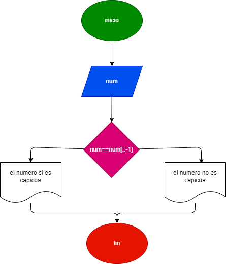

#   Determinar si un número es capicúa o no. Se dice que un número capicúa es aquel que al invertir sus cifras da el mismo número. Por ejemplo, 12321 invertido es 12321. Entonces es un número capicúa

